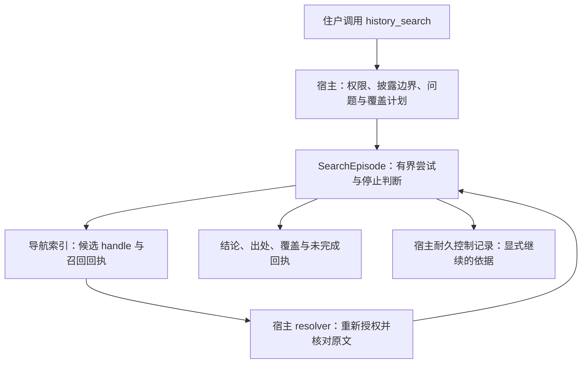

# history_search / SearchEpisode：Phase 0 图纸

对应 [#152](https://github.com/mist-agent-harness/mist-agent/issues/152)，收编
[#144 主笔拍板](https://github.com/mist-agent-harness/mist-agent/issues/144#issuecomment-5612141804)、
[最小图纸及十二组验收](https://github.com/mist-agent-harness/mist-agent/issues/144#issuecomment-5567476644)
与[资料域披露更正](https://github.com/mist-agent-harness/mist-agent/issues/144#issuecomment-5567511104)。
本单交付设计与[全未勾选验收](../../acceptance/history-search.md)，不实现、不接生产。
D16 已由 [PR #153](https://github.com/mist-agent-harness/mist-agent/pull/153) 收入
[决策台账](../decisions.md)，本稿不另行拍板。

## 目标与边界

住户说“找一下之前说过的那件事”，入口把模糊线索变成有边界的调查：提出查询，
找候选，回原文核证，证据够了或资源用完时停下，交付能回源的结果与未完成范围。
对住户叫 `history_search`，内部叫 `SearchEpisode`。它不接管 message tree、generation、
事实 supersede 或长期记忆，也不自动把命中塞进下一窗 prompt。

Phase 0 只覆盖 canonical stream / window history / handoff 三种逻辑视图，复用既有
权威底座和证据面，不另造原文库。项目工作区后接；邮件等例子只说明通用身份语义，
不是首期 source adapter。window history 的局部 transcript 仍是证据，不升级成主流消息。

导航索引的当前工单是 [#151](https://github.com/mist-agent-harness/mist-agent/issues/151)，
不是 #150（[#131 编号更正](https://github.com/mist-agent-harness/mist-agent/issues/131#issuecomment-5612143030)）。
#151 管“原文可能在哪”：可重建 projection、候选 handle、分页和召回回执；本单管
“怎么查、证据够不够、何时停”。索引不能宣布事实确认，本单不能另开绕过索引和宿主
边界的内容搜索后门。`baoer_signal_grep` 可作内容检索前门，不充当 canonical source。

代价：多一轮回源会慢；第一版不能搜项目代码；索引不可用时只能降级调查，不能改权威状态。

## 调查链路

用户明确的时间、来源、路径等是硬约束；agent 自猜的年代、关键词、同义词是可撤回
假设，两者必须分开记录。可以换假设找下一条，不得为了命中而放宽用户范围或授权。
问题需先分清“曾发生”与“截至某时最新／仍有效”，它们不能共用一条完成判据。

每轮查询前声明 `required / optional` 召回通道与目标范围。改 query、handle、范围或
索引 snapshot 是新 attempt，保留与旧尝试的关系；成功的 B 不能把失败的 A 洗成“已恢复”。
计划可以追加修订，但失败后不能删除必要通道，再拿新计划证明旧问题已查全。
新增获准资料域须记录前后差异；此前 scoped 结论仍只属于此前范围。

代价：多记一层计划和尝试，输出可能是“尚无结论”；避免用一条漂亮的状态掩盖失败。

## 最小控制记录：只钉语义，不冻结字段

下面是评审用的记录分工，不是可提交的 JSON schema。#120 稳定 ID 与读取接缝落定后，
实现单再对齐字段拼写、持久化位置和端点；本单不预定数据库表或新增 canonical purpose。

| 记录 | 必须表达什么 |
| --- | --- |
| Question | 用户硬约束、可撤回假设、待证明的命题，以及历史存在性／截至指定水位的最新或有效性 |
| CoveragePlan | 问题涉及且宿主获准知道的资料域、获准检索范围、已知未覆盖域、搜索前声明的必要与可选通道 |
| Attempt | episode 与 attempt 身份、实际 query、scope、provider/index 版本、policy 条件、目标与索引水位、cursor 所属 snapshot、消耗、故障与计划修订关系 |
| Evidence | source handle、原始事件身份、版本/hash、实际作者、适用的容器／方向／发布状态、已取上下文及核证结果 |
| Result | execution、stopReason、coverage、instrument、nullable conclusion、出处与尚缺证据；披露过滤后的用户视图 |

coverage 至少分清：实际查了什么、候选保留了多少、展示了多少、实际回源核了什么。
top-k、分页、结果截断或展示三条，都不能改写成“全部查过”。source domain、时间范围、
所用方法、索引版本／水位及未完成分支应足以限定结论；未知完整性不能写成完整。

代价：回执比单一 `status` 长；宿主可给用户短版，但不可因此丢掉可审计的范围事实。

## 证据与回源

候选的 snippet、score、路径和行号只用于导航。确认前按当前授权解析 handle，核对
原始事件身份、版本/hash、作者与足够上下文。源内容变化、权限撤销、上下文不全或
无法回源必须可区分；缓存命中不延长授权，拒绝信息也不能带出被撤销内容。

作者、容器、方向与发布状态按 source domain 的真实语义定义，不能从正文猜；
缺少必要元数据时，不作依赖它的身份断言。没有容器／方向概念的域明确“不适用”，
不虚构 Inbox 或 Sent。handoff 证明“住户当时写了这封信”，其中转述不能升级为用户原话。

同一原始事件经 canonical、window 或索引投影命中，只算一份证据；没有可靠共同身份时
保留去重不确定性，不能靠文本相似就合并两个不同事件。历史事件 hash 正确只说明那一版
未改，不证明后来没有撤销、修订或 supersede。

宿主必须在调用前限制可查询范围。若检索器在 path 零命中时会自动扩到根，适配必须
显式要求 strict，并在执行前拒绝越界；结果检查只是第二道闸。query、read、source-use
和显式 context injection 分别授权、留回执，读到的文本始终是材料而非执行指令。

代价：原文完整但身份不明也可能只能留候选；同文多源不能靠相似度省掉核验。

## 仪器状态不等于扫描完整性

每个参与本次结论的 `source domain × recall channel` 需要控制查询。它必须走实际
provider、索引路径、scope、policy 和版本／水位；控制样本必须有依据证明当前获准读取、
且应已入索引。无有效样本、样本未收录或已撤权时记健康未确认，不擅自诊断 provider 坏了。
不得用另一条 health endpoint 成功代替真实搜索路径。

探针通过只证明该路径、分区、版本、水位和时刻的可用性；控制分区正常，目标分区仍可能
漏索引或落后。因此 instrument 与 coverage 分开记。依赖通道静默返回空必须被负例抓住；
恢复后重跑保留前次失败。探针、重试和回源都计入同一预算，不能为了负结论省掉必要检查。

代价：健康检查消耗预算且不能证明全域完整；预算不足时如实停在未完成。

## 何时可以交卷

执行停止与事实结论是两个轴。取消、超时、预算耗尽、provider 失败可以结束执行，
但不会自动产生 `not_found`。没有足够证据时 `conclusion = null`；确有可用线索时可交
`candidates`，并说明还缺什么。停止前已经独立核实的证据可以保留，交卷时仍须满足当前权限。

| 结论 | 最低证据要求 |
| --- | --- |
| confirmed：曾发生 | 完整回源且身份、上下文与问题指纹相符；不要求无关分支全部扫完，未完成覆盖仍如实列出 |
| confirmed：最新／仍有效 | 除原事件核证外，检查至声明的时间水位及相关后续修订、撤销或事实 supersede；上游无法提供时不能确认现行性 |
| candidates | 确有相关、可回源且可披露的候选，但仍有真实歧义或证据缺口；最多展示三条，标出保留／展示截断，不倾倒全文 |
| not_found | 本次预声明的必要范围和通道已完成且健康、权限与版本检查通过，但按该计划仍缺足够证据；仅对本次范围、方法和水位成立 |
| null | 尚无足够证据支持以上任何结论；另报停止原因、已查范围与下一步缺口 |

必要通道失败不能支持 `not_found`；可选 shadow 通道失败不否决独立原文支持的存在性
`confirmed`，但不能据此声称“没有别的”或“这是最新”。完整词法零命中不是语义全集证明。
“最多三条”来自 #144 评审版的交卷约束，限制展示，不是召回阈值；延迟、轮次、调用数
与预算默认值尚未拍定，须先冻结合成 corpus 和基线，再依据评测定值。

用户已知或当前 policy 允许讨论的未接入资料域，必须点名说明缺口与用户可执行的下一步。
不可披露的隔离域，其存在、名称、数量和内容均不得通过候选、计数、摘要、错误或回执侧漏。
宿主内部记录也不得绕过自身权限枚举全库；用户短版只保留与隐藏域是否存在无关的边界声明。
已知未接入域若是问题的必要范围，不能宣布整个问题 `not_found`；最多作已查子域的有界
未找到陈述。隐藏域不改变获准范围内的证明，也不构成可披露的“还有其他来源”提示。

代价：交卷往往带有明确边界；有些调查必须停在候选或空结论，不能靠“没找到”收尾。

## 跨 session 与写入边界

episode、attempt、成功／失败／取消回执和累计预算要耐久保存。进程重启只恢复可读取的
记录，不自动发起查询；住户显式继续后重新核权限、版本、水位和预算。换窗不重置消耗。
cursor 必须绑定原查询和候选 snapshot；过期须显式报告，另起尝试不能冒充原分页无缝继续。
取消或崩溃后的在途调用应由宿主协调并保留未决状态，不能假定免费、成功或未执行。

复用宿主耐久底座，由宿主拥有的有界 adapter 提交控制记录，沿既有唯一 writer 写入。
不得向模型开放任意 canonical append，也不得复制完整 transcript 或私有推理。
控制回执不自动变成记忆、事实账、聊天消息或下一窗 prompt；显式注入是另一项动作。

代价：多一份受权限约束的控制记录与恢复协调；没有可靠预算／写入接缝时实现必须显式阻塞。

## 当前接缝与实现前置

以下仅为基于 main `aba49ad` 的源码与清单核对，不是 SearchEpisode 的运行验收。

| 上游 | 已有接缝 | 本单不能当作已完成的部分 |
| --- | --- | --- |
| #84 canonical stream | [event-contract.ts](../../src/one-stream/event-contract.ts) 的 eventId / streamSeq / payloadHash、authoritySource / origin；[writer.ts](../../src/one-stream/writer.ts) 唯一写方 | actor 元数据不自动等于用户原话身份；搜索 ACL、source adapter、episode 有界写入尚需接线 |
| #120 window history | [WH-01–06](../../acceptance/window-history.md) 已有全未勾选规格；[workspace-read-model.ts](../../src/one-stream/workspace-read-model.ts) 的 EvidenceViewportReader 经 canonical result pointer 读证据面 | 不等同于生产 MistWindowHistoryPort 已持久化；稳定寻址、分页、故障与跨进程恢复仍由 #120 判卷，不能绕过证据面权限 |
| #81 handoff | [handover-letters.ts](../../src/one-stream/handover-letters.ts) 沿同一 stream 按标题回源，区分 found / not-found / unavailable | 标题导航不自动证明用户原话；搜索 resolver、权限刷新和统一 handle 契约待对齐 |
| #151 导航索引 | Phase 0 已授权出图纸：可重建 projection、handle、召回回执 | 字段不在本单抢冻；服务不可用、候选截断、索引水位与 cursor 需独立适配验收 |

实现单先把本页语义验收变成可执行红测试，再接 #120 的稳定契约；不以其他模块绿灯替
本单点灯。质量评测同时看误确认、越权、真例确认率与不必要的人类接管；性能阈值从
固定 corpus 和基线长出来。代价：依赖未齐会等待，但本图纸和判据可以先评审。
